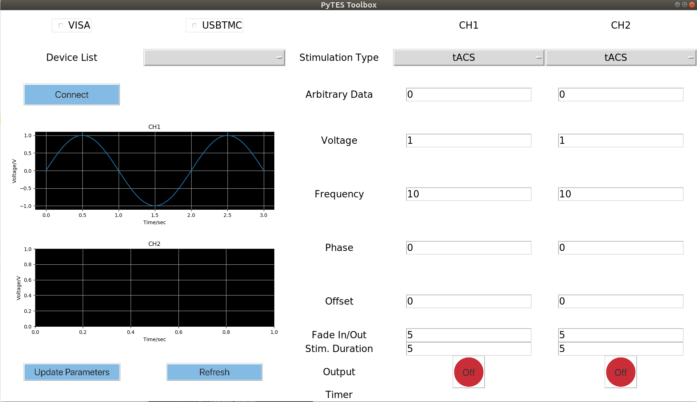

  PyTES README
========================================

PyTES is a Python-based, 3-clause BSD licensed toolbox to facilitate the remote control of transcranial electric stimulation and ease the deployment of a closed-loop TES system. PyTES supports two types of communication protocols to control the hardware: VISA and USBTMC. More detailed about there differences can be refered to the paper. 


 
****

## Contents

* [Installation](#Installation)
* [Features](#Features)
    * Plug-in-play
    * Closed-loop application
    * TES with arbitrary signal
    * Timer for stimulation and fade in/out duration (GUI version)
* [Usage](#Usage)
    * Command line 
    * GUI 
    * In Psychopy
    * In OpenVibe 
* [Known Issues](#Issues)

## Installation
-----

### Prerequiste
Different operating system and communication protocol has diverse prerequistes for installing and using the PyTES package. A brief summary is listed below:
|           |   USBTMC   |    VISA    |
|:---------:|:----------:|:----------:|
|   Linux   |    None    |[pyvisa](#Pyvisa)|
|  Windows  |    N/A     |[pyvisa](#Pyvisa) + [driver](#Driver)|

#### Pyvisa
More details about the installation of pyvisa can be found [here][pyvisa_link] 

#### Driver 
Driver installation subjects to the chosen hardware(s). For exmaple, the Rigol arbitrary waveform generator requires the type-specific IVI driver, as listed [here][rigoldriver]. Users of PyTES are suggested to install the driver according to the official documentaion of their own device(s).

### PyTES


## Features 
-----
### Plug-in-play
This feature leverages the default USBTMC driver of Linux system such that the USBTMC interface can be opened as a file node. Please note that this feature is only available for Linux users with using USBTMC protocol.

### Closed-loop application
PyTES can be seamlessly combined with other online experiment framework to constitute a closed-loop TES system, e.g., OpenVibe and Psychopy. More details for the usage can be refered to [OpenVibe](#OpenVibe) and [Psychopy](#Psychopy)

### PyTES with arbitrary signal
Some advanced TES require a non-regular shape of stimualtion signal, e.g., AM-tACS, etc. To better support such studies, PyTES provides such function to output an user-defined signal. 
* In the GUI version, the signal should be first used to create a dictionary as shown below. Next, this dictionary should be saved as a pickle file. Finally, input the path of pickle file into the corresponding entry.

```Python
data_to_save = {'sps': sampling_rate_in_Hz,
                'data': a_list_of_all_data_points}
```
* In the command line version, you can use the function `SignalGenerator().arb_func()` to output the arbitrary signal.

### Timer for stimulation and fade in/out duration (GUI version only)
For the GUI version of PyTES, the timers for stimulation and fade in/out can be set seperately for different output channels. No input for these entries will indicate either indefinite stimulation or no fade in/out for the corresponding channel.

## Usage
-----

### Command Line 

The usage via command line version is just as same as the other Python packages. One example for controling the stimulation amplitude of tACS signal is as shown below:

```Python
import SignalGenerator as SG()
SG().amp(value=1, stim_mode='tACS')

```

PyTES also provides many other functions to conveniently adjust the stimulation paramters, e.g., frequency, offset, phase, etc. More functions can be found at [here](./signal_generator.py#L475).

In additiona to the provided functions, it is also possible and convenient to directly send SCPI command via PyTES to communicate with the hardware with the function [`SG().set_cmd()`](./signal_generator.py#L383).


### GUI 
* __Step 1__: Driver selection, USBTMC or VISA (Note: USBTMC is not applicable for Windows; For USBTMC protocol, the root access is required)

* __Step 2__: Device selection from the option menu
* __Step 3__: Connection test via clicking "Connect" button
* __Step 4__: Parameter setup
    * tDCS/tACS/tRNS - Fill in the value in the allowable entry
    * Arbitraty signal stimulation - Input the absolute path to the data file (in .pkl format, more details refer to [Features](#Features) )
* __Step 5__: Stimulation signal check via clicking "Update Parameters" button
* __Step 6__: Timer setup for stimulation duration and fade in/out duration.
    * `None` value for stimulation duration means a indefinite stimulation
    * `None` value for fade duration means no fade in/out will be applied
* __Step 7__: Output stimulation signal via clicking "Output" of target channel

Step 1 - 5:

https://user-images.githubusercontent.com/27919893/167694285-08fd13ac-9ce1-4704-9b3f-1793c79d7791.mp4

Step 6 - 7:

https://user-images.githubusercontent.com/27919893/167694322-c0be0b92-31af-499b-8efa-535c65c14e07.mp4

### Psychopy
To integrate the real-time stimulation signal control code into the experimental paradigm written by PsychoPy, you can leverage the [Code Component][psychopy] function of PsychoPy, in which the snippets of PyTES control commands can be inserted into the experimental paradigm code.

### OpenVibe 
For OpenVibe users, you can use [The Python Scripting box][openvibe] to integrate the PyTES command to control the stimulation signal based on the online decoding results.


## Issues 
-----
1. __Font issues of the GUI version__
The PyTES GUI is based on the package tkinter. It is known that the tkinter font cannot be correctly rendered under Anaconda Python on Ubuntu system. For better visualization, it is suggested to switch to non-conda Python installation. More discussion about this issue can be found [here][condaissue]

      
2. __USBTMC driver cannot be selected after using the VISA driver__
Devices which are already opened by VISA protocol cannot be opened by USBTMC drivers. Restarting the hardware devices can fix the issue.
    
-----
[pyvisa_link]: https://pyvisa.readthedocs.io/en/latest/introduction/getting.html
[condaissue]: https://github.com/ContinuumIO/anaconda-issues/issues/6833#issuecomment-351363320
[rigoldriver]: https://www.rigolna.com/download
[psychopy]: https://www.psychopy.org/builder/components/code.html
[openvibe]: http://openvibe.inria.fr/tutorial-using-python-with-openvibe/#The+Python+Scripting+box
[pytesfunction]: https://github.com/TateXu/pytes/blob/cb66334b7d7131cd4810b9c9db1c80861fc94695/signal_generator.py#L475


